# VAANI User Flow Diagrams

Visual diagrams for Create mode user flows. These diagrams can be rendered in GitHub, Notion, or any Mermaid-compatible viewer.

---

## 1. Master User Journey

---

## 2. Entry Points Flowchart

---

## 3. Create Mode State Machine

---

## 4. Transaction Type Decision Flow

---

## 5. Expense Flow Detail

---

## 6. Sale Flow Detail

---

## 7. Payment Flows

### Payment In

### Payment Out

---

## 8. Edge Case Handling

---

## 9. Error Handling Flow

---

## 10. Find Mode (WIP)

```mermaid
flowchart TD
    A[Find Tab Clicked] --> B{Feature Status}

    B -->|Coming Soon| C[WIP Screen]

    C --> D["🚧 Coming Soon 🚧"]
    D --> E[Show Example Queries]

    E --> F["• What were my sales yesterday?<br/>• How much did I spend on fuel?<br/>• Who owes me money?<br/>• Show top selling items"]

    F --> G[Notify Me Button]
    G --> H{User Clicks}

    H -->|Yes| I[Capture Email/Notification Pref]
    H -->|No| J[Stay on Screen]

    I --> K[Confirmation Toast]

    style C fill:#fff9c4
    style D fill:#fff9c4
```

---

## 11. Mode Status Overview

---

## 12. Transaction Type Distribution (Target)

---

## 13. Success Funnel

---

## How to Use These Diagrams

1. **GitHub**: These diagrams render automatically in GitHub markdown
2. **Notion**: Use the Mermaid code block feature
3. **VS Code**: Install "Markdown Preview Mermaid Support" extension
4. **Online**: Use [mermaid.live](https://mermaid.live) to view/edit

---

*Diagrams created for VAANI Create Mode Launch*
